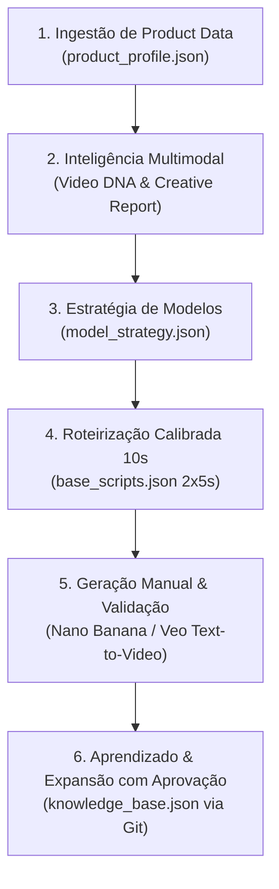

# 🚀 Criação Manual VDS — Hub de Roteirização e Inteligência Text-to-Video (10s)

Repositório dedicado à **criação manual, validação e expansão de repertório de roteiros Text-to-Video (10 segundos)** para modelos de IA generativa (Nano Banana, Google Veo, Runway Gen-3).

---

## 🏗️ Desenho e Representação do Processo Completo



---

## 📁 Estrutura do Repositório

```text
criacao manual vds/
├── banco_de_dados/
│   ├── knowledge_base.json            # Base canônica com 7 modelos (incluindo os novos) e histórico de evidências
│   └── protocolo_atualizacao_kb.md    # Regra obrigatória: aprovação humana prévia antes de qualquer gravação
├── categorias/
│   └── regras_por_categoria.md        # Diretrizes e exigências técnicas (Cozinha, Beleza/Cabelos, Moda, Eletrônicos)
├── regras_processo/
│   ├── processo_detalhado_ponta_a_ponta.md  # DETALHAMENTO COMPLETO DE CADA ETAPA DO PROCESSO
│   └── regras_formato_10s.md          # Regras inegociáveis de timing (2x5s), locução (8-11 palavras) e faceless
├── templates_roteiros/
│   └── templates_modelos.md           # Templates prontos para copiar e colar no motor de vídeo
└── README.md                          # Este guia mestre do repositório
```

---

## 📖 Documentos Detalhados de Referência

1. **[Processo Completo de Ponta a Ponta](regras_processo/processo_detalhado_ponta_a_ponta.md):** Explicação aprofundada das 6 etapas (Ingestão $\to$ DNA Multimodal $\to$ Estratégia $\to$ Roteiros 10s $\to$ Geração Manual $\to$ Retroalimentação com Aprovação).
2. **[Regras de Formato 10s](regras_processo/regras_formato_10s.md):** A fórmula matemática para evitar cortes de áudio ($2 \times 5\text{s}$, 8 a 11 palavras por cena).
3. **[Regras por Categoria](categorias/regras_por_categoria.md):** Exigências sensoriais e físicas obrigatórias para Cozinha, Cabelos, Moda e Eletrônicos.
4. **[Protocolo de Atualização da Knowledge Base](banco_de_dados/protocolo_atualizacao_kb.md):** Como propor e aprovar novos modelos e aprendizados no banco de dados.

---

## 🧠 Modelos Narrativos Disponíveis no Banco de Dados

1. **`HAND_DEMO_VOICEOVER`**: Foco em unboxing, textura, manuseio de mãos e detalhes macro.
2. **`PROBLEM_SOLUTION`**: Foco na dor comum do consumidor vs. resolução imediata com o produto.
3. **`STRESS_TEST_DEMO`**: Teste extremo de eficácia (ovo/queijo na panela seca, resistência máxima).
4. **`THERMAL_TECH_SHOWCASE`**: Tecnologia visível (LEDs de íons negativos, display de temperatura, vapor volumétrico).
5. **`UNBOXING_ASMR`**: Experiência sensorial tátil e sonora ao abrir e organizar o kit.
6. **`PRODUCT_SHOWCASE`**: Exibição estética em 360° com takes lentos de estúdio.
7. **`POV_SKETCH`**: Visão em primeira pessoa simulando a experiência do comprador.

---

## 🛑 Regra de Ouro do Processo de Aprendizado Contínuo

Sempre após a conclusão de uma leva de roteiros:
1. Analisar o que o produto e os vídeos ensinaram de novo.
2. Formular propostas de novos modelos ou exigências de categoria.
3. **Apresentar ao usuário no chat para aprovação prévia**.
4. Somente após o *"ok"* do usuário, sincronizar no Git e no `knowledge_base.json`.
