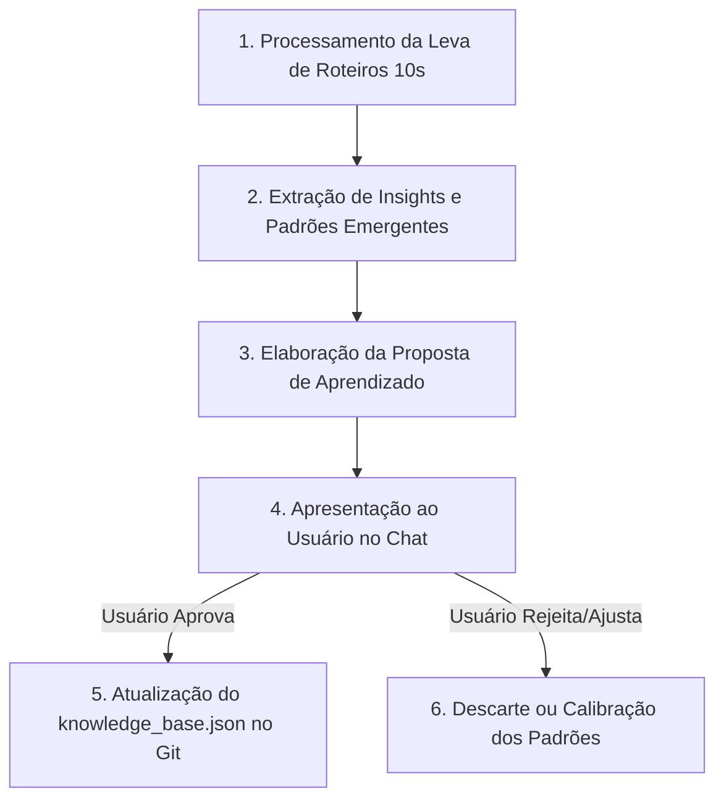

# 📝 Protocolo de Expansão e Atualização da Knowledge Base

Sempre que uma nova leva de produtos ou vídeos de referência for analisada, siga este passo a passo antes de alterar o banco de dados.

---

## 🔄 Fluxo de Atualização com Aprovação Humana



---

## 📋 Modelo de Proposta para Apresentar ao Usuário:

```markdown
### 🧠 Proposta de Atualização da Knowledge Base

Analisamos o produto **[Nome do Produto]** e identificamos os seguintes aprendizados:

1. **Novo Modelo Identificado:** `NOME_DO_MODELO`
   - *Descrição:* Como funciona e onde performa melhor.
   - *Padrão Visual:* Ângulos de câmera e iluminação recomendados.
   - *Padrão de Áudio:* Tipo de hook e ritmo de locução.

2. **Detalhes Específicos para a Categoria `[Nome da Categoria]`:**
   - *Item 1:* Exigência visual específica no roteiro.
   - *Item 2:* Detalhe sensorial a ser cobrado.

**Você aprova a inclusão desses itens na nossa Knowledge Base oficial?**
```
