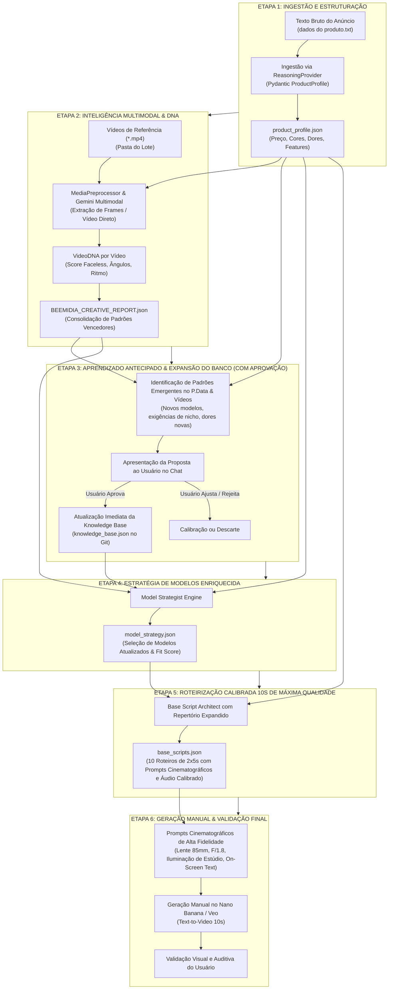
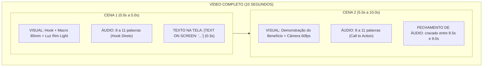
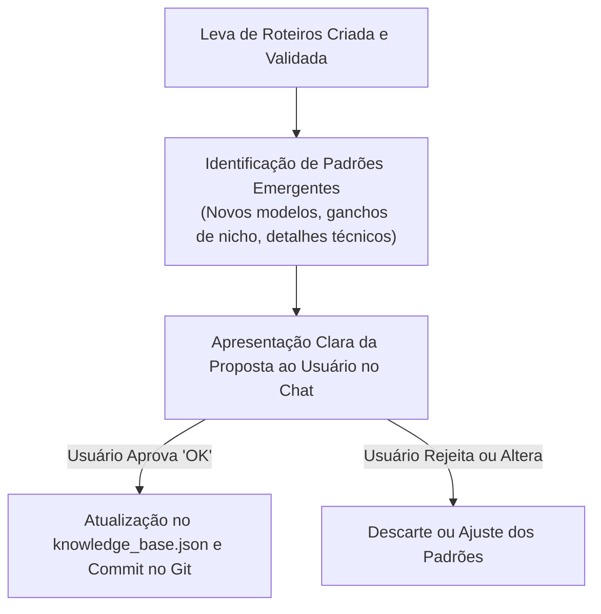

# 🐝 BeeMidia — Arquitetura Completa do Processo Text-to-Video 10s

Documentação técnica profunda que detalha **o ciclo de vida completo de ponta a ponta**, desde a injeção do `Product Data`, inteligência multimodal, estratégia criativa, roteirização calibrada em 10 segundos, renderização manual no Nano Banana até a expansão e retroalimentação do banco de dados com aprovação humana prévia.

---

## 🏗️ 1. O Fluxo Completo de Ponta a Ponta (Diagrama Mestre)

---

## 🧩 2. Detalhamento Passo a Passo de Cada Etapa

---

### 📦 ETAPA 1: Injeção de Product Data (`product_profile.json`)

* **Entrada:** Texto cru copiado do anúncio ou fornecedor (`dados do produto.txt`).
* **Processamento:**
  1. A IA lê o texto bruto ignorando poluição visual, formatações quebradas ou emojis excessivos.
  2. Extrai e normaliza os dados essenciais através do contrato Pydantic `ProductProfile`.
  3. Realiza autocorreção automática caso algum campo falhe na primeira tentativa.
* **Arquivo Gerado:** `product_profile.json`
* **Campos Canônicos:**
  - `product_id`: Slug único (ex: `gokoco-escova-modeladora-ions-38mm`).
  - `product_name`: Nome completo do item.
  - `product_category` e `subcategory`: Classificação de nicho.
  - `average_price`: Preço médio numérico padronizado.
  - `available_colors` e `available_sizes`: Variações físicas.
  - `key_features`: Lista de diferenciais técnicos reais (sem claims falsos).
  - `main_pain_points_solved`: Dores específicas que o item resolve.

---

### 🧬 ETAPA 2: Inteligência Multimodal & Creative Report (`BEEMIDIA_CREATIVE_REPORT.json`)

* **Entrada:** Vídeos de concorrentes/referências colocados na pasta (`*.mp4`) + `product_profile.json`.
* **Processamento:**
  1. `MediaPreprocessor` avalia o vídeo nativo ou extrai frames temporais ordenados via OpenCV.
  2. A IA multimodal audita cada segundo do vídeo:
     - **Score Faceless ($0$ a $5$):** Verifica ausência de rosto e presença de mãos/bancada.
     - **Ganchos (Hooks):** O que aparece nos primeiros 3 segundos (texto na tela, ação rápida).
     - **Padrão Sonoro:** Estilo de voz (comercial, dinâmico, ASMR, música trend).
     - **Padrão Visual:** Ângulos de câmera, iluminação e enquadramento.
  3. Agregação em um relatório estatístico de inteligência criativa.
* **Arquivo Gerado:** `BEEMIDIA_CREATIVE_REPORT.json`

---

### 🎯 ETAPA 3: Estratégia de Modelos Criativos (`model_strategy.json`)

* **Entrada:** `product_profile.json` + `BEEMIDIA_CREATIVE_REPORT.json` + `knowledge_base.json`.
* **Processamento:**
  1. O algoritmo cruza os dados do produto com o banco de modelos canônicos.
  2. Calcula o **Fit Score** ($0.0$ a $1.0$) para cada modelo narrativo.
  3. Divide a cota de vídeos do lote (ex: 50% `HAND_DEMO_VOICEOVER` e 50% `PROBLEM_SOLUTION`).
* **Arquivo Gerado:** `model_strategy.json`

---

### ⏱️ ETAPA 4: Roteirização Calibrada para 10 Segundos (`base_scripts.json`)

A regra de engenharia inegociável para garantir que **o áudio nunca corte no meio e o vídeo tenha impacto imediato**:

#### 📐 As Regras Rígidas de Timing e Direção de Arte:
1. **Duração por Cena:** Exatamente $2 \text{ cenas} \times 5 \text{ segundos} = 10 \text{ segundos}$.
2. **Limite de Locução:** Máximo de **8 a 11 palavras por cena** (máx. 22 palavras no total). A taxa de fala humana natural encerra aos **8.8s**, deixando respiro sem corte.
3. **Padrão Faceless:** 100% livre de rostos (ombros para baixo, mãos manicuradas, bancada de mármore/quartzo).
4. **Prompt Cinematográfico:** Sempre inclui Lente (`85mm macro lens`), Abertura (`f/1.8 bokeh`), Iluminação (`soft studio rim light, volumetric steam/glow`) e Movimento (`smooth dolly-in, 60fps`).

---

### 🎨 ETAPA 5: Geração Manual no Nano Banana & Validação

1. Os prompts e locuções estruturados no `base_scripts.json` são entregues prontos para copiar e colar no motor **Nano Banana / Veo**.
2. O usuário gera as cenas de 5s e valida visualmente a renderização física, iluminação e a sincronia da locução.

---

### 🧠 ETAPA 6: Aprendizado Contínuo & Atualização do Banco (Aprovação Obrigatória)

#### 🛑 Regra de Ouro da Memória:
**NENHUM dado, modelo ou categoria é gravado silenciosamente na Knowledge Base.** O sistema sempre formula uma proposta objetiva no chat e aguarda o seu *"ok"* antes de atualizar o `knowledge_base.json`.
